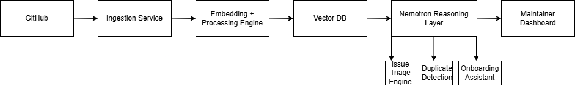

# Maintainer Copilot

## Team Name :

Saarthi

## Project Description

Maintainer Copilot is an AI-powered workflow assistant designed to reduce the cognitive load on open-source maintainers.

The system combines semantic retrieval, vector search, GitHub repository context, and NVIDIA Nemotron-powered reasoning to provide:

* Issue Triaging
* Semantic Duplicate Detection
* Contributor Onboarding Assistance

By leveraging repository knowledge and historical issues, Maintainer Copilot helps maintainers identify duplicate reports, understand issue impact, and help contributors more effectively.

## Architecture Diagram

## Demo Video

YouTube: https://youtu.be/4AuuSi_LUP4

## Medium Blog Post

Medium: https://medium.com/@tany007/building-maintainer-copilot-using-nvidia-nemotron-to-reduce-open-source-maintainer-workload-0510cde1b95d

## LinkedIn Post

LinkedIn: https://www.linkedin.com/posts/activity-7467157524048158720-_7a_?utm_source=share&utm_medium=member_desktop&rcm=ACoAABmIvm0BaQhslqCU8lvKpeZQlSPNXthW2y4

## Tech Stack

* FastAPI
* NVIDIA Nemotron
* ChromaDB
* GitHub REST API
* HTML/CSS/JavaScript

## Repository Structure

Refer to the project [README](submissions/track_2_maintainer_copilot/maintainer-copilot/README.md) for detailed setup instructions and implementation details.
